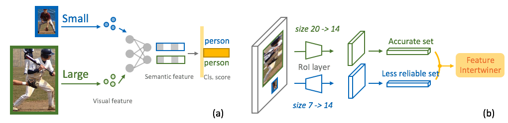
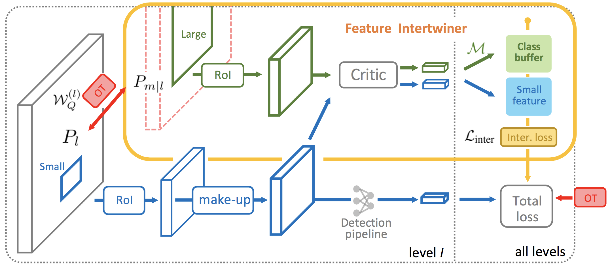

## Feature Intertwiner for Object Detection


A PyTorch implementation of our paper published at ICLR 2019.

By [Hongyang Li](http://www.ee.cuhk.edu.hk/~yangli/), 
[Bo Dai](http://daibo.info/),
[Shaoshuai Shi](https://scholar.google.com.hk/citations?user=DC9wzBgAAAAJ&hl=en), 
Wanli Ouyang, and Xiaogang Wang.

**Paper:** 
[[arXiv]](https://arxiv.org/abs/1903.11851)
[[Openreview]](https://openreview.net/forum?id=SyxZJn05YX) 

**A 50-min talk** presented at GTC 2019:
[[GTC Video]](https://on-demand.gputechconf.com/gtc/2019/video/_/S9551/) 
[[GTC Slides]](https://docs.google.com/presentation/d/12Syg5OXD6nGwtG_nwmoQ4kqX5GtJ-5pJ1OuVY53FqB0/edit?usp=sharing)

### Overview

Our assumption is that semantic features for one category should be the same as shown
in (a) below. Due to the inferior up-sampling design in RoI operation, shown in 
(b), the reliable set (green) *could* guide the feature learning of the less
reliable set (blue).





Here comes the proposed feature intertwiner:





- PyTorch `0.3` 
- Code/framework based on Mask-RCNN.
- Datasets: COCO and Pascal VOC (not in this repo)

### How to run

Follow instructions in [`INSTALL.md`](INSTALL.md) to 
set up datasets, symlinks, compilation, etc.

To **train**,
`
sh script/base_4gpu    105/meta_105_quick_1   0,2,5,7   # gpu ids
`
or:  

simply execute `python main.py`. The configurations are stored 
in the `configs` folder.

To **test**,
change the flag `--phase` in `main.py` to `inference`. 

### Performance

Object detection single-model performance (bounding box AP) on the COCO `test-dev`.
The InterNet `multi-scale` is achieved with data augmentation, 1.5× longer training time and multi-scale
training. Our InterNet is also a two-stage detector.

| methods    | backbone           | AP  | AP_50 | AP_75 | AP_small|  AP_medium | AP_large| 
| :-----: | :-----: | :-----:| :----: |:----:| :----:|:----:| :----:|
| YOLOv2     | DarkNet-19  | 21.6  | 44.0 | 19.2 | 5.0 | 22.4 | 35.5 |
| SSD513     | ResNet-101-SSD | 31.2 | 50.4 | 33.3 | 10.2 | 34.5 | 49.8 |
| R-FCN     | ResNet-101 | 29.9 | 51.9 | - | 10.8 | 32.8 | 45.0 |
| Mask-RCNN     | ResNet-101-FPN | 38.2 | 60.3 | 41.7 | 20.1 | 41.1 | 50.2 |
| InterNet     | ResNet-101-FPN | **42.5** | **65.1** | **49.4** | 25.4 | 46.6 | 54.3 |
| InterNet `multi-scale`    | ResNet-101-FPN | 44.2 | 67.5 | 51.1 | 27.2 | 50.3 | 57.7 |

### Adapting Feature Intertwiner to your own task

This is probably the most concerned part for most audience.

### Citation
Please cite in the following manner if you find it useful in your research:
```
@inproceedings{li2019_internet,
  title = {{Feature Intertwiner for Object Detection}},
  author = {Hongyang Li and Bo Dai and Shaoshuai Shi and Wanli Ouyanbg and Xiaogang Wang},
  booktitle = {ICLR},
  year = {2019}
}
```


